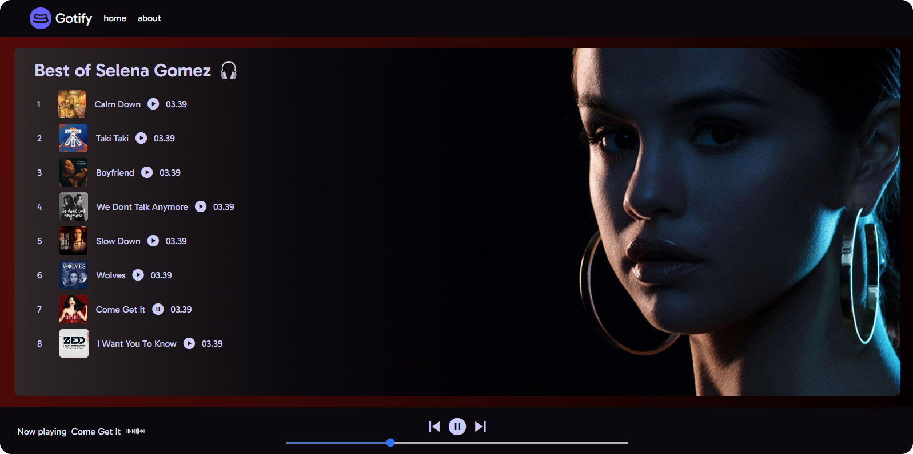

# 🎵 Gotify - Static Music Player.  <a href="https://gotify-pro.netlify.app/" target="_blank"> Visit Gotify<a/>


<div align="center">
  
</div>

Gotify is a simple and elegant music player that plays a selection of 10 songs by Selena Gomez. Each time a song changes, the background color also changes, providing a dynamic and engaging experience. This project is built with basic JavaScript and styled with Tailwind CSS.

## 🌟 Features

- 🎶 **10 Selena Gomez Songs**: Enjoy a curated playlist of some of Selena's top hits.
- 🎨 **Dynamic Backgrounds**: The background color changes with every song to keep things fresh.
- 🚀 **Lightweight & Fast**: Simple, static project with no external dependencies.

## 🛠️ Technologies Used

- **JavaScript**: Core functionality for the music player.
- **Tailwind CSS**: For styling and creating a responsive design.



## 📦 Installation

Since this is a static project, you can simply clone the repository and open the `index.html` file in your browser.

```bash
git clone https://github.com/satish-hebbal/Gotify.git
cd Gotify
open index.html
